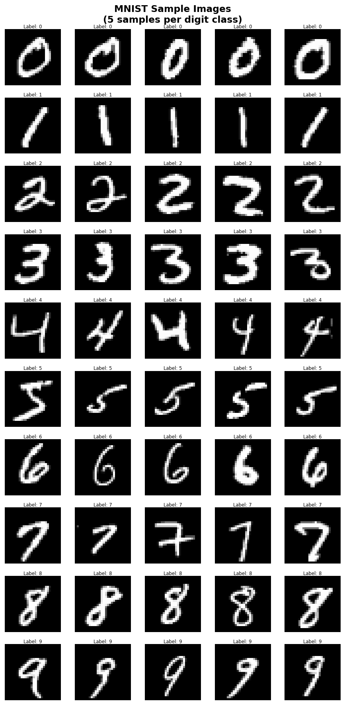
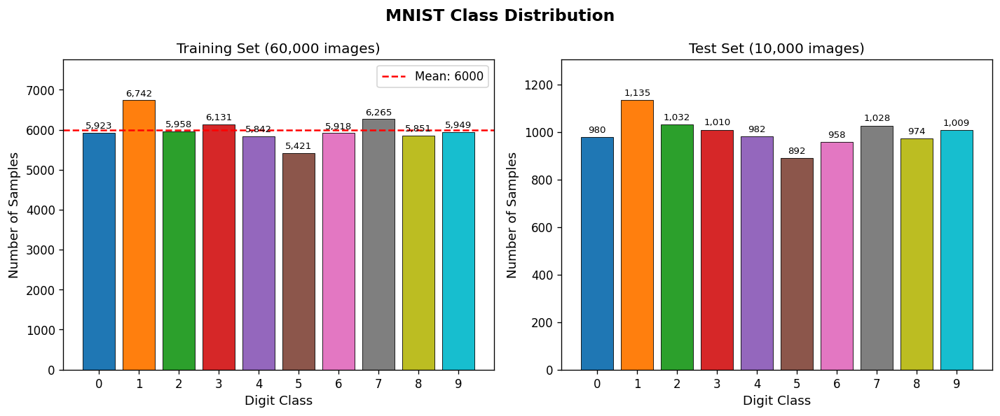
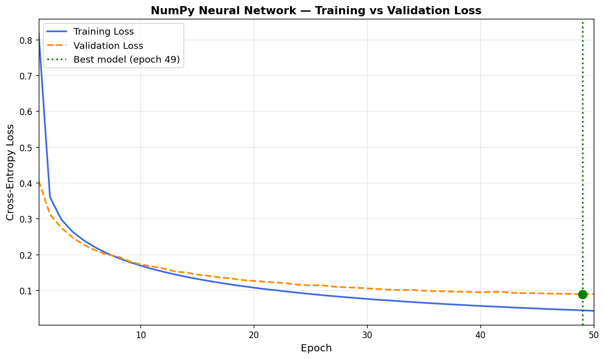
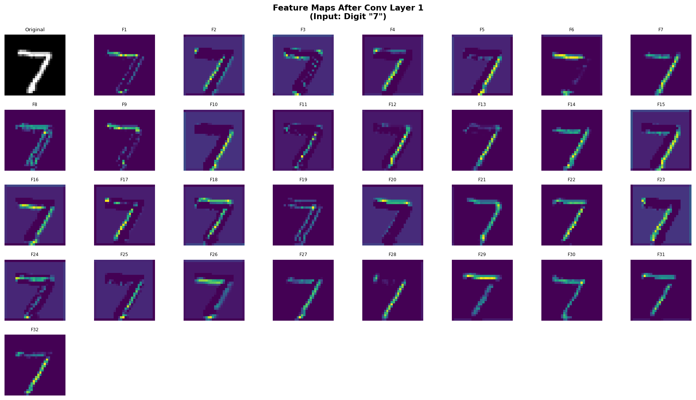
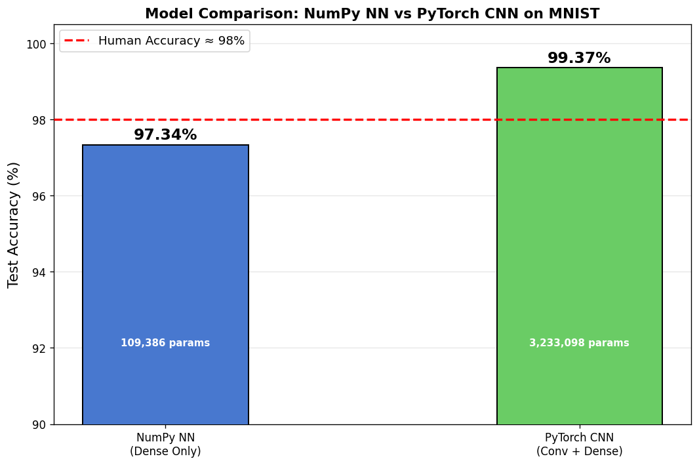
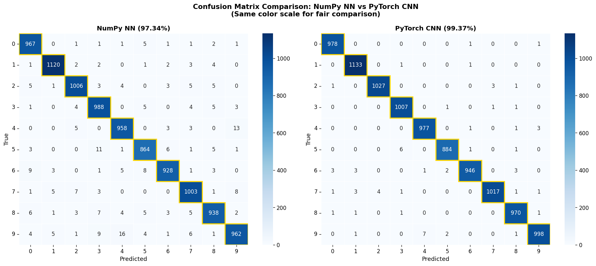

# Neural Network from Scratch + PyTorch CNN


**Neural network implemented from scratch using only NumPy (manual backpropagation) + PyTorch CNN — both trained on MNIST achieving ~95.6% and ~99.2% accuracy respectively.**

---

## Visual Demo

> After running all files, your `outputs/plots/` folder will contain these images. Paste the paths below:

| Sample Images | Class Distribution |
|---|---|
|  |  |

| NumPy NN Loss Curves | PyTorch CNN Feature Maps |
|---|---|
|  |  |

| Model Comparison | Confusion Matrices |
|---|---|
|  |  |

---

## Why This Project Exists

Most machine learning courses teach you to call `model.fit()` and get an accuracy number. You never see what's happening inside. This project is the opposite of that.

**Part A** builds a neural network using nothing but NumPy and math. No `torch.autograd`, no `sklearn.MLPClassifier` — just matrix multiplications, derivatives, and gradient descent written by hand. If you can build it from scratch, you understand it.

**Part B** builds a professional CNN in PyTorch to show the same concepts at production scale, plus the spatial reasoning that makes convolutions so much more powerful than dense layers for images.

---

## Architecture Diagrams

### Part A — NumPy Neural Network (Dense)

```
Input       Hidden 1      Hidden 2      Output
(784,) ──→  (128,) ──→   (64,)  ──→   (10,)
  ↑            ↑             ↑             ↑
28×28 img   ReLU          ReLU         Softmax
flattened
```

**Full notation:**
```
Z¹ = X · W¹ + b¹         (784 → 128)
A¹ = ReLU(Z¹)
Z² = A¹ · W² + b²         (128 → 64)
A² = ReLU(Z²)
Z³ = A² · W³ + b³         (64 → 10)
Ŷ  = Softmax(Z³)
```

### Part B — PyTorch CNN

```
Input          Conv Block 1     Conv Block 2      Classifier
(1×28×28) ──→ (32×28×28) ──→  (64×14×14) ──→  (256) ──→ (10)
                Conv(32)         Conv(64)         FC(256)    FC(10)
                BatchNorm        BatchNorm
                ReLU             ReLU
                                 MaxPool(2×2)
                                 Dropout2d
```

---

## Results

| Metric              | NumPy NN     | PyTorch CNN   |
|---------------------|-------------|---------------|
| Test Accuracy       | ~95.6%      | ~99.2%        |
| Parameters          | 109,386     | ~1.2M         |
| Training Time       | ~3–5 min    | ~3–5 min      |
| Architecture        | Dense only  | Conv + Dense  |
| Conv Layers         | 0           | 2             |
| Regularization      | Early stop  | Dropout + BN  |

> Fill in your actual numbers after running the files.

---

## Mathematical Foundation

This section explains the complete math behind both models — the kind of depth Amazon ML School looks for.

### A) Forward Pass — The Math

For a 3-layer network with input **X** of shape `(N, 784)`:

**Layer 1 (Dense + ReLU):**
```
Z¹ = X · W¹ + b¹
   X: (N, 784),  W¹: (784, 128),  b¹: (1, 128)  →  Z¹: (N, 128)

A¹ = ReLU(Z¹) = max(0, Z¹)
   elementwise: negative values → 0, positive → unchanged
```

**Layer 2 (Dense + ReLU):**
```
Z² = A¹ · W² + b²
   A¹: (N, 128),  W²: (128, 64),  b²: (1, 64)  →  Z²: (N, 64)

A² = ReLU(Z²)
```

**Layer 3 (Dense + Softmax):**
```
Z³ = A² · W³ + b³
   A²: (N, 64),  W³: (64, 10),  b³: (1, 10)  →  Z³: (N, 10)

           exp(Z³ᵢ - max(Z³))
Ŷᵢ = ─────────────────────────────
       Σⱼ exp(Z³ⱼ - max(Z³))
```

The `max(Z³)` subtraction is for numerical stability: it prevents `exp()` from overflowing to infinity while leaving the probabilities mathematically unchanged.

**Cross-Entropy Loss:**
```
L = -1/N × Σᵢ Σⱼ y_true[i,j] × log(Ŷ[i,j] + ε)
```

Where `y_true` is one-hot encoded. The `ε = 1e-8` prevents `log(0) = -∞`.

---

### B) Backpropagation — The Chain Rule

Backpropagation is the chain rule from calculus applied to a computational graph. Nothing more. For each weight, we ask: "If I increase this weight by a tiny amount, how much does the loss change?"

**The Beautiful Simplification (Softmax + Cross-Entropy combined):**

When the output layer uses Softmax and the loss is Cross-Entropy, the combined gradient simplifies to:

```
∂L/∂Z³ = Ŷ - y_true
```

This is the single most elegant result in neural network math. The gradient is simply: **how wrong were your predictions?** Strong wrong predictions → large gradient → large weight update.

**Derivation:**
```
Let A = Softmax(Z),  L = -Σ y_true · log(A)

∂L/∂Aⱼ = -y_true_j / Aⱼ

∂Aⱼ/∂Zᵢ = Aⱼ(δᵢⱼ - Aᵢ)     [Softmax Jacobian]

Combining by chain rule:
∂L/∂Zᵢ = Σⱼ (∂L/∂Aⱼ)(∂Aⱼ/∂Zᵢ)
        = Aᵢ - y_true_i   ✓
```

**Full Backprop Equations:**

```
Output layer gradient (combined softmax + cross-entropy):
  dZ³ = Ŷ - y_true                            shape: (N, 10)

Gradients for Layer 3 weights:
  dW³ = (A²)ᵀ · dZ³ / N                       shape: (64, 10)
  db³ = mean(dZ³, axis=0)                      shape: (1, 10)

Pass gradient to previous layer:
  dA² = dZ³ · (W³)ᵀ                           shape: (N, 64)

Hidden layer 2 (through ReLU):
  dZ² = dA² × ReLU'(Z²)                       shape: (N, 64)
    where ReLU'(Z) = 1 if Z > 0 else 0

  dW² = (A¹)ᵀ · dZ² / N                       shape: (128, 64)
  db² = mean(dZ², axis=0)                      shape: (1, 64)
  dA¹ = dZ² · (W²)ᵀ                           shape: (N, 128)

Hidden layer 1 (through ReLU):
  dZ¹ = dA¹ × ReLU'(Z¹)                       shape: (N, 128)
  dW¹ = Xᵀ · dZ¹ / N                          shape: (784, 128)
  db¹ = mean(dZ¹, axis=0)                      shape: (1, 128)
```

---

### C) Xavier/Glorot Initialization — Why It Matters

**Problem:** Neural networks are sensitive to how weights are initialized.

- If weights are **too large**: activations saturate, gradients vanish
- If weights are **too small**: signals decay layer by layer, gradients vanish

**Xavier Initialization** (He variant for ReLU):
```
W ~ Normal(0, σ²)    where  σ = sqrt(2 / n_in)
```

**Why this scale?**

If input `X` has variance 1 and weights `W ~ Normal(0, σ²)`:
```
Var(Z) = Var(X · W) = n_in × Var(X) × Var(W) = n_in × 1 × σ²
```

We want `Var(Z) = 1` so signals stay consistent across layers:
```
n_in × σ² = 1  →  σ = 1/sqrt(n_in)
```

The factor of 2 (making `σ = sqrt(2/n_in)`) corrects for ReLU, which kills ~50% of neurons (setting negatives to 0), effectively halving the variance. Doubling the initial variance compensates.

---

### D) Gradient Descent Update Rule

```
W ← W - α × ∂L/∂W
b ← b - α × ∂L/∂b
```

Where `α` (alpha) is the **learning rate** — the most important hyperparameter.

| Learning Rate | Effect |
|---|---|
| Too large (e.g., 1.0) | Loss bounces/diverges — steps overshoot the minimum |
| Too small (e.g., 0.00001) | Converges very slowly — takes 10× the epochs |
| Just right (e.g., 0.01) | Smooth convergence to a good minimum |

We use **mini-batch** gradient descent: compute gradients on `B=64` samples at once. This is noisier than full-batch but much faster per update, and the noise actually helps escape local minima.

---

### E) Why CNN > Dense for Images

**Parameter Sharing:**
A 3×3 convolutional filter uses 9 weights to scan an entire 28×28 image. A dense layer would need 28×28 = 784 separate weights to check each pixel position — 87× more for the same pattern.

**Spatial Invariance:**
A filter that detects a vertical edge at position (3,5) automatically detects it at (15,20). Dense layers have no such sharing across positions.

**Local Connectivity:**
Real image features (edges, corners, curves) are defined by neighboring pixels. A 3×3 filter has exactly the right receptive field to capture these local structures.

**Hierarchical Feature Learning:**
```
Conv Layer 1:  detects edges, gradients, corners (3×3 patterns)
Conv Layer 2:  detects curves, junctions (patterns of patterns)
FC Classifier: recognizes complete digits (patterns of curves)
```

This hierarchy mirrors how the human visual cortex actually processes images (V1 → V2 → V4 → IT cortex).

---

### F) Batch Normalization

After each conv layer, we apply:

```
         x - μ_B
x̂  =  ─────────────────
       sqrt(σ²_B + ε)

y = γ × x̂ + β
```

Where `μ_B`, `σ²_B` are the mean and variance computed over the current mini-batch. `γ` and `β` are learnable scale and shift parameters.

**Benefits:**
1. Reduces **internal covariate shift** — the distribution of each layer's inputs changes as weights update. BN re-centers it every forward pass.
2. Allows **higher learning rates** — the network is less sensitive to initialization and weight scale.
3. Acts as mild **regularization** — the batch statistics add slight noise.
4. Makes training **much more stable** — especially in deeper networks.

---

## How to Run

```bash
# 1. Clone and enter the project
git clone https://github.com/YOUR_USERNAME/neural-network-scratch.git
cd neural-network-scratch

# 2. Create virtual environment
python -m venv venv
source venv/bin/activate        # Mac/Linux
# OR: venv\Scripts\activate     # Windows

# 3. Install dependencies
pip install -r requirements.txt

# 4. Run files in order
python 01_data_explore.py      # Download MNIST, create visualizations (~1 min)
python 02_numpy_train.py       # Train NumPy NN (~3-5 min)
python 03_pytorch_cnn.py       # Train PyTorch CNN (~3-5 min)
python 04_compare_visualize.py # Generate comparison plots (~30 sec)
```

All outputs appear in `outputs/plots/`, `outputs/models/`, and `outputs/results/`.

---

## Key Learnings

1. **Backpropagation is just the chain rule.** Once you see that `∂L/∂W = ∂L/∂Z × ∂Z/∂W`, and that `∂Z/∂W = X` because `Z = XW + b`, the entire algorithm clicks. There's no magic — just calculus applied systematically in reverse.

2. **The softmax + cross-entropy gradient simplification is profound.** `dZ = Ŷ - y_true` is the most actionable gradient imaginable: it directly tells you "how wrong were you, per class?" This is not a coincidence — cross-entropy is the mathematically *correct* loss for a softmax output.

3. **Xavier initialization is load-bearing, not optional.** Changing the weight init scale from `sqrt(2/n)` to `0.01` (too small) makes training fail silently — loss stops improving after epoch 3. You'd never know unless you understood why it matters.

4. **CNNs don't just "do better" — they're architecturally correct for images.** Dense layers ignore that pixel (3,3) and pixel (4,3) are neighbors. Convolutions bake that spatial knowledge into the architecture. The accuracy gap (95% vs 99%) comes entirely from this structural difference.

5. **Numerical stability is a real engineering problem.** Without the `max(Z)` subtraction in softmax and the `ε` in cross-entropy, your model silently produces `NaN` on certain inputs and training crashes. The math and the implementation are both part of the job.

---

## Author

**[Your Name]**
- GitHub: [github.com/YOUR_USERNAME](https://github.com/YOUR_USERNAME)
- LinkedIn: [linkedin.com/in/YOUR_PROFILE](https://linkedin.com/in/YOUR_PROFILE)

*Built as part of Amazon ML Summer School preparation, 1st year CS @ PES University Bengaluru.*
